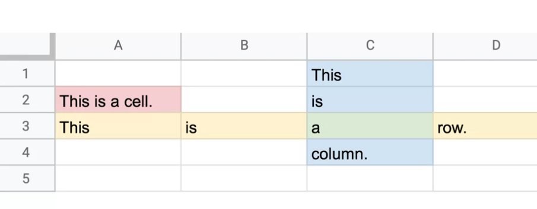
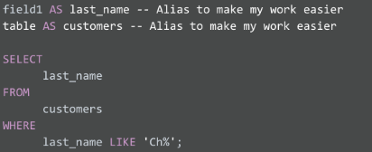
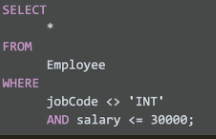

# Mastering Spreadsheets

> Attribute - a characteristic or quality of data used to label a column in a table

> Observation - all of the attributes for something contained in a row of a data table

> Formula - a set of instructions that performs a specific action using the data in a spreadsheet
>
> Function - 

# Structured Query Language (SQL)

- store
- organize
- analyze
- used for storing LARGE amounts of data

> Query - a request for data from a database

**WHERE field1 = 'Chavez'**

However, if you are looking for all customers with a last name that begins with the letters “Ch," the WHERE clause would be:

**WHERE field1 LIKE 'Ch%'**

- you should use the asterisk (*) sparingly and with caution
- Comments are text placed between certain characters, **/*** and  ***/** , or after two dashes ( **--** ) as shown below.
- make it easier on yourself by assigning a new name or **alias **to the column or table names to make them easier to work with

- The **AND** clause enables you to test for both conditions.

[W3Schools SQL Tutorial](https://www.w3schools.com/sql/default.asp "W3Schools SQL Tutorial")

[SQL Cheat Sheet](https://towardsdatascience.com/sql-cheat-sheet-776f8e3189fa "SQL Cheat Sheet")

# Data Visualization

A way to present data, for easier understanding

'Data visualizations are pictures. They are a wonderful way to take very basic ideas around data and data points and make them come alive'
