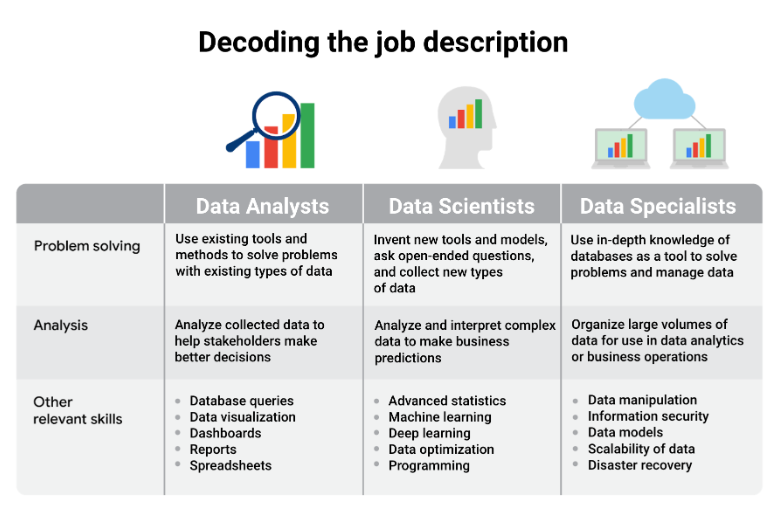

# Data Analyst Job Opportunities

Technology

Finance

Healthcare

Government

Hospitality

Marketing

# The Importance of Fair Business Decisions

# Exploring Your Next Job

Industry

Tools

Location - where do you want to live? travel opportunuties? remote work?

Travel

Culture - values? 

Financial - 

Telecomm -

Tech - 

- all use data differently

"what are you interested in?"

- helping people?
- financial?

"what motivates you"

* Business analyst — analyzes data to help businesses improve processes, products, or services
* Data analytics consultant — analyzes the systems and models for using data
* Data engineer — prepares and integrates data from different sources for analytical use
* Data scientist — uses expert skills in technology and social science to find trends through data analysis
* Data specialist — organizes or converts data for use in databases or software systems
* Operations analyst — analyzes data to assess the performance of business operations and workflows

* Marketing analyst — analyzes market conditions to assess the potential sales of products and services
* HR/payroll analyst — analyzes payroll data for inefficiencies and errors
* Financial analyst — analyzes financial status by collecting, monitoring, and reviewing data
* Risk analyst — analyzes financial documents, economic conditions, and client data to help companies determine the level of risk involved in making a particular business decision
* Healthcare analyst — analyzes medical data to improve the business aspect of hospitals and medical facilities

## Interview Tips

"Think about a time where you've used data to solve a problem, whether it's in you're professional or personal projects"

- increase professional network

"Really important to have your LinkedIn updated along with websites, like GitHub where you can showcase a lot of the data analyst projects you've done"

- prepare questions for the interviewer
  - not broad, questions about the team and the specific work

"Sometimes there is no right answer, and a lot of the times interviewers are looking to see your thought process and the way you get your solution"

"Look for the recruiter. Look for the hiring manager online. See if you can reach out to them and set up a coffee chat or send them your resume directly"

-
