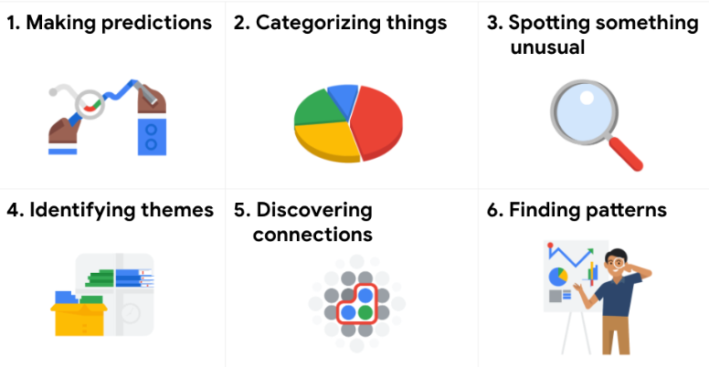
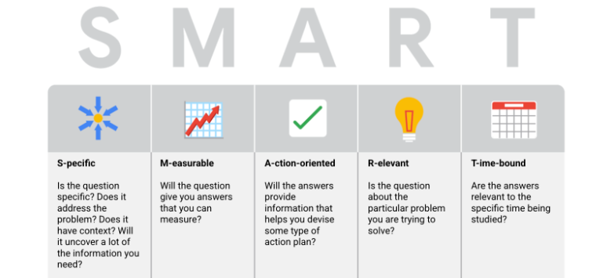

# Problem-Solving and Effective Questioning

Define the problem and expectations

problem-solving, and most common business problems that data analysts help solve

> Structured Thinking - the process of recognizing the current problem or situation, organizing available information, revealing gaps and opportunities, and identifying the options

# Take Action with Data

## Step 1: Ask

It’s impossible to solve a problem if you don’t know what it is. These are some things to consider:

* Define the problem you’re trying to solve
* Make sure you fully understand the stakeholder’s expectations
* Focus on the actual problem and avoid any distractions
* Collaborate with stakeholders and keep an open line of communication
* Take a step back and see the whole situation in context

### Questions to ask yourself in this step:

1. What are my stakeholders saying their problems are?
2. Now that I’ve identified the issues, how can I help the stakeholders resolve their questions?

## Step 2: Prepare

You will decide what data you need to collect in order to answer your questions and how to organize it so that it is useful. You might use your business task to decide:

* What metrics to measure
* Locate data in your database
* Create security measures to protect that data

### Questions to ask yourself in this step:

1. What do I need to figure out how to solve this problem?
2. What research do I need to do?

## Step 3: Process

Clean data is the best data and you will need to clean up your data to get rid of any possible errors, inaccuracies, or inconsistencies. This might mean:

* Using spreadsheet functions to find incorrectly entered data
* Using SQL functions to check for extra spaces
* Removing repeated entries
* Checking as much as possible for bias in the data

### Questions to ask yourself in this step:

1. What data errors or inaccuracies might get in my way of getting the best possible answer to the problem I am trying to solve?
2. How can I clean my data so the information I have is more consistent?

## Step 4: Analyze

You will want to think analytically about your data. At this stage, you might sort and format your data to make it easier to:

* Perform calculations
* Combine data from multiple sources
* Create tables with your results

### Questions to ask yourself in this step:

1. What story is my data telling me?
2. How will my data help me solve this problem?
3. Who needs my company’s product or service? What type of person is most likely to use it?

## Step 5: Share

Everyone shares their results differently so be sure to summarize your results with clear and enticing visuals of your analysis using data via tools like graphs or dashboards. This is your chance to show the stakeholders you have solved their problem and how you got there. Sharing will certainly help your team:

* Make better decisions
* Make more informed decisions
* Lead to stronger outcomes
* Successfully communicate your findings

### Questions to ask yourself in this step:

1. How can I make what I present to the stakeholders engaging and easy to understand?
2. What would help me understand this if I were the listener?

## Step 6: Act

Now it’s time to act on your data. You will take everything you have learned from your data analysis and put it to use. This could mean providing your stakeholders with recommendations based on your findings so they can make data-driven decisions.

### Questions to ask yourself in this step:

1. How can I use the feedback I received during the share phase (step 5) to actually meet the stakeholder’s needs and expectations?

These six steps can help you to break the data analysis process into smaller, manageable parts, which is called  **structured thinking** . This process involves four basic activities:

1. Recognizing the current problem or situation
2. Organizing available information
3. Revealing gaps and opportunities
4. Identifying your options

# Solve Problems with Data

#### Problem Types

1. Making predicitons- using data to make an informed decision about how things may be in the future
2. Categorizing things - assigning information to different groups or clusters based on common features
3. Spotting something unusual - identifying data that is different then the norm
4. Identifying themes - grouping categorized information into broader concepts
5. Discovering connections - finding similar challenges faced by different entities and combining data and insights to address them
6. Finding patterns - using historical data to understand what happened in the past and is therefore likely to happen again

# Craft Effective Questions

#### SMART Questions

Leading Questions 

- questions that lead you to a specific answer
- That was a great sandwich, wasn't it? (what if you don't agree)

Closed-ended Questions 

- yes or no questions
- Did you enjoy the show?

Questions that are too vague and lack context - do you like chocolate or vanilla?

- Ice cream, pudding, coffee? What if you dont like either flavour? What if you like chocolate ice cream but vanilla in your coffee?

##### Specific

- specific questions are simple, significant, and focused on a single topic or a few closely related ideas

##### Measurable

- measurable questions can be quantified and assessed

##### Action-oriented

- action-oriented questions encourage change

##### Relevant

- relevant questions matter, are important, and have significance to the problem you're trying to solve

##### Time-bound

- time-bound questions specify the time to be studied

> Fairness - ensuring that your questions don't create or reinforce bias

