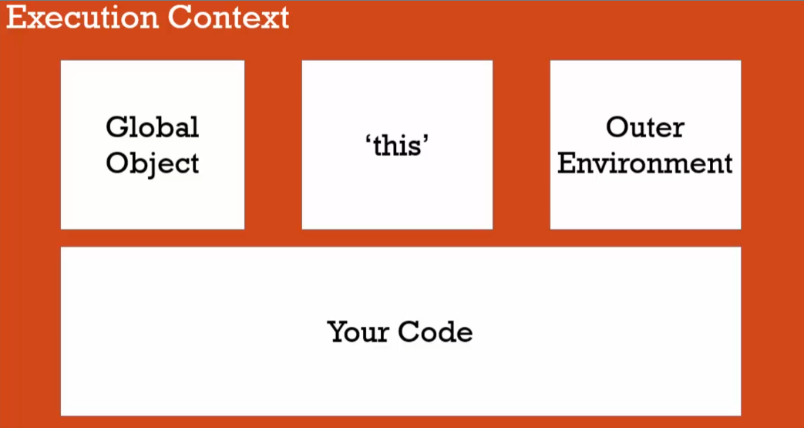
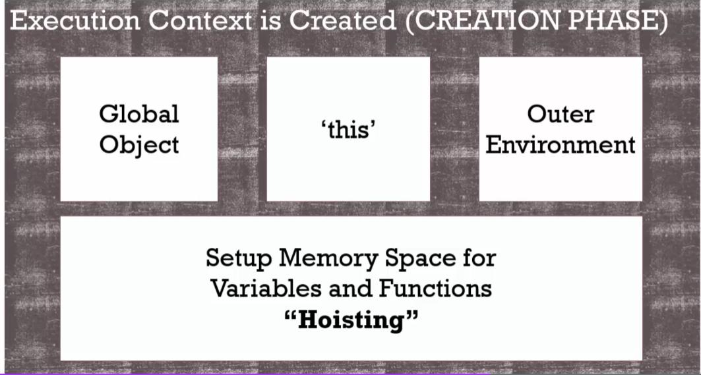
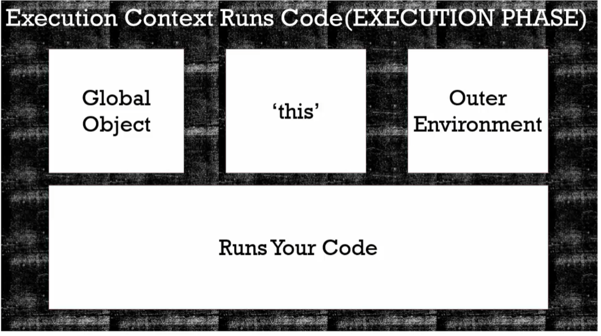
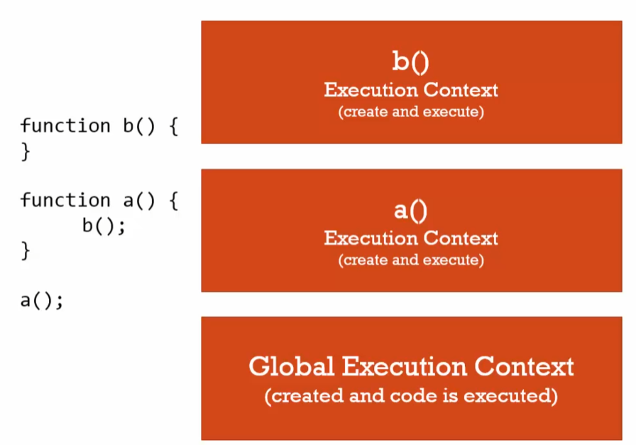

# JS - Understanding the Weird Parts

## Section 1: Execution Contexts and Lexical Environments
***

**Syntax Parsers**: a program that reads your code and determines what it does and if its grammer is valid

**Execution Contexts**: a wrapper to help manage the code that's running

**Lexical Environments**: where somthing sits physically in the code you write<br>
* Where you write something is important

### Name/Value Pairs and Objects
***
**Name/Value Pair**: a name which maps to a unique value
```Javascript
let address = '100 Main St'
```

**Object**: a collection of name value pairs
```Javascript
let address: {
    street: 'Main',
    number: 100,
    apartment: {
        floor: 3,
        number: 301
    }
}
```

### Global Environment and Global Object
***


"not inside a function" = Global

### Execution Context: Creation and Hoisting
Execution context is created in 2 phases - creation phase and execution phase

#### **CREATION PHASE**

if we call a variable before it's defined we will get 'undefined', variable is still stored in memory and still exists
```Javascript
let a;
///this will be undefined in the console
```
#### **EXECUTION PHASE**

Your code will be run line by line

**Single Threaded**: one command is being executed at a time<br>
**Synchronous**: one at a time and in order (the order that the code is written)

### Function Invocation and Execution Context
***
**Invocation**: running/calling a function (ex. a();)<br>
* everytime a function is invoked a new execution context is created and put on the execution stack


### Functions, Context and Variable Environments
***
**Variable Environment**: where the variables live and how they interact in the environment<br>
* each execution context has it's own variable environment (memory space for variables)

**Scope**: where are we able to see the variable

### The Scope Chain
***
* if a function in the execution stack cannot find a variable within the function called, it will check the global context

**Asynchronous**: more than 1 at a time

**Event Queue**: when the execution stack is empty/done running, then the event queue will look for events

## Section 3: Types and Operators
***

### Types and Javascript
***
**Primitive Types**: variables can hold different types of values because it's figured out during execution

**Static Typing**: you tell the compiler what data ahead of time
```Javascript
bool isNew = 'hello'; //an error
```

### Primitive Types
***

**Primitive Type**: a type of data that represents a single value (that us not an object)<br>
1. **undefined**: lack of existance (don't set a variable to undefined),
2. **null**: lack of existence (you can set a variable to null),
3. **boolean**: true or false,
4. **number**: floating point (always a decimal),
5. **string**: a sequence of characters,
6. **symbol**: used is ES6 (*, #, !, etc)

### Operators
***

**Operator**: a special function that is syntactically (written) differently. Generally taking two params and returning one result
1. **infix notation**: operator sits between two params `3 + 4`
2. **prefix notation**:  `+ (3, 4)`
3. **postfix notation**: `(3, 4)+`

### Operator Precedence and Associativity
***

**Operator Precedence**: which operator function gets called first (higher precedence wins)

* JS and many languages have a list of operator precedences. Much like BEDMAS

**Associativity**: what order operator functions get called in: left-to-right or right-to-left (when functions have the same precedence)

### Coersion
***

**Coersion**: counverting a value from one type to another

``` Javascript
let a = 1 + '2' // the 1 was coersed into a string
console.log(a); // 12
```
* JS tries to convert things into what we want instead of throwing errors

### Comparison Operators
***

```Javascript
console.log(1 < 2 < 3); // true
console.log(3 < 2 < 1); // true due to associativity 
```
* reads L-to-R `(3 < 2)` = false 
* false is coersed to a number `(0)`
* `(0 < 1)` = true

**NaN**: not a number

## Section 3: Objects and Functions
***

### Objects and the Dot

* objects sit in memory and have properties and methods
* computed member access ...[...]
> member of the object (like fingers are members of the body)
* Dot is an operator (member access)

### Objects and Object Literals
***

```Javascript
let person = new Object(); 
person['firstname'] = 'Steph';
person['lastname'] = 'Clark'
//and
let person = {
    firstname: 'Steph',
    lastname: 'Clark'
}
//are the same thing - second way is preferred and more widely used
```
* you can add to the object using the Dot operator `person.address = { key: 'value'}`

**Namespace**: a container for variables and functions

* use objects as containers (namespaces)

### JSON and Object Literals 
***

**JSON**: JavaScript Object Notation

1. `JSON.stringify()`: will convert a normal object to JSON format
   
2. `JSON.parse()`: will convert to normal 'code' object

### Functions are Objects 
***

**First Class Functions**: eveything you can do with other 'types' you can do with functions

* assign them to variables, pass them around, create then on the fly

### Function Statements and Function Expressions
***

**Expression**: a unit of code that results in a value

#### By Value and By Reference 

**Mutate**: to change something
**Immutatable**: con't be changed

```Javascript
// by value (primitives)

let a = 3;
let b;
b = a;
a = 2;
console.log(a); // 2
console.log(b); // 3

// makes a 'copy', different location in memory
```

```Javascript
// by reference

let c = { greeting: 'Hi' };
let d;
d = c;
c.greeting = 'Hello'; // mutation of c
console.log(c); // 'Hello'
console.log(d); // 'Hello'

// points to the same location in memory
```

* the '=' operator sets up new memory space

### Objects, Functions and 'this'
***

```Javascript
let c = {
    name: 'The c Object',
    log: function() {
        // let self = this;
        this.name = 'Updated c Object';
        // console.log(self);
        console.log(this);

        let setname = function(newname) {
            // self.newname
            this.name = newname;
        }
        setname('Updated again');
        // console.log(self);
        console.log(this);
    }
}
```

* 'this' points to the global object (most coders say this is buggy)
* by adding `let self = this;` to the top of the object, it will carry down 'this' keyword without bugging out the global object

### Arrays - Collections of Anything 
***

* arrays can hold anything 

```Javascript
let array = [
    1,
    true,
    'string',
    { object: 'yes' },
    function(){}
];
```

### Arguments and Spread 
***

**Arguments**: the parameters you pass to a function

* JS gives you a keyword of the same name which contains them all
* can use arguments keyword inside a function that takes params, outputs it in an array

```Javascript
function greet(firstname, lastname, language) {
    console.log(arguments);
}

greet('Steph', 'Clark', 'en');

// will display ['Steph', 'Clark', 'en']
```

### Function Overloading 
***

* the ability to create multiple functions of the same name with different implementations

### Syntax Parsers 
***
* read code and decide if it's valid (reads character by character, making assumptions)

### Automatic Semicolon Insertion 
***

* always put your own semi-colons

**Carriage Retun**: represents the passing of the 'enter' key

```Javascript
function getPerson() {
    return // pressing 'enter' represents a CR, and inserts a ';' ending the line of code
    {
        firstname: 'Steph'
    }
}
// JS automatically inserted a semi-colon due to the CR making the code after 'return' unreadable

// this code will not run

function getPerson() {
    return {
        firstname: 'Steph'
    }
}

// this code will run fine
```

**Whitespace**: invisible characters that create literal 'space' in you written code (CR's, tabs, spaces)

### Immediately Invoked Function Expressions (IIFE)
***

```Javascript
let greeting(name) {
    console.log('Hello' + name);
} ();
// this represents an IIFE

let firstname = 'Steph';

(function(name) {
    let greeting = 'Inside IIFE: Hello';
    console.log(greeting + ' ' + name);
} ('Steph'));
// console displays `Inside IIFE: Hello Steph`
// this is a classic IIFE
```

### Understanding Closures
***

```Javascript
function greet(whattosay) {
    return function(name) {
        console.log(whattosay + ' ' + name);
    }
};

let sayHi = greet('Hi');
sayHi('Steph')
// console displays 'Hi Steph'
```

### Function Factories
***

* a function that makes or returns other things for me 
* everytime you call a function, it has a new execution context

### Closures and Callbacks 
***

**Callback Function**: a function you give to another function to be run when the other function is finished

### call(), apply(), bind()
***

**.bind()** : creates a copy of whatever function that precedes it, and attaches whatever [object/method] is in the parenthesis

* when you create a function on the fly that uses the 'this' keyword and instead of undefined you want a  specific object to represent 'this'

```Javascript
let person = {
    firstname: 'Steph',
    lastname: 'Clark',
    getFullName: function() {
        let fullname = this.firstname + ' ' + this.lastname;
        return fullname;
    }
}

let logName = function(lang1, lang2) {
    console.log('Logged: ' + this.getFullName());
    console.log('Arguments: ' + lang1 + lang2);
    console.log('--------------');
}

let logPersonName = logName.bind(person);
// binds the person object to the logName function, so that it has access to the properties and methods

logPersonName('en', 'es');
```

**.call()** : lets you call the function

* a lot like `.bind()` but also executes the function

**.apply()** : the same as call, except wants parameters in the form of an array instead of a list

`.apply(person, ['en', 'es'])`

**Function Borrowing**: `person.getFullName.apply(person2)` borrowed a function from one object with data for the 'this' keyword of a different object

**Function Currying**: using bind to set a permanent parameter

* useful in methematical situations

### Functional Programming 
***

* to limit work/typing we use a lot of functions

References to libraries for research:<br>
    underscore.js<br>
    lodash.com

### Classical vs. Prototypal Inheritance
***

**Inheritance**: one object gets access to the properties and methods of another object

**Classical Inheritance**: (C#, Java), the way it's been done for a long time

**Prototypal Inheritance**: (JS), newer and simpler

### Reflection and Extend
***

**Reflection**: an obvject can look at itself, listing and changing it's properties and methods

### Function Constructors, 'new', History of JS

`let john = new Person();`

* 'new' is an operator, which creates an empty object, and invokes the function

**Function Constructor**: a normal function that's used to construct objects

* the 'this' variable points to a new empty object, and that object is returned from the function

### Function Constructors and '.protoype'
***

* using `.prototype` to set methods outside of the function constructor, available to all 'new' objects

`Person.prototype.getFullName = function() {}` etc

### Built-In Function Constructors 
***

* already there! `Number, String, Date`

### Object.create and Pure Prototypal Inheritance
***

**Polyfill**: code that adds a feature which the engine may lack

## Section 4: Examining Famous Frameworks and Libraries
***

### learning from other's good code ~ an open source education
***

* learn from other famous frameworks

* github.com 

* download libraries, (uncompressed development)

### Deep Dive into Source Code: jQuery
***

`init.prototype = jQuery.fn;`

* `jQuery.fn` is the prototype

Easier to understand source code, because we know the fundamentals 

Can you ideas from source code, for your own projects

**Method Chaining**: calling one method after another, and each method affects the parent object

```javascript
let q = $('ul.people').addClass('newClass').removeClass('people')
```

* the `.addClass()` function `returns` at the end and returns the 'this' variable which is pointing to the parent element, which is how we can chain methods and have them affect the parent each time

* Giant library of methods

* Don't be afraid of good code, it'll make you a better developer


